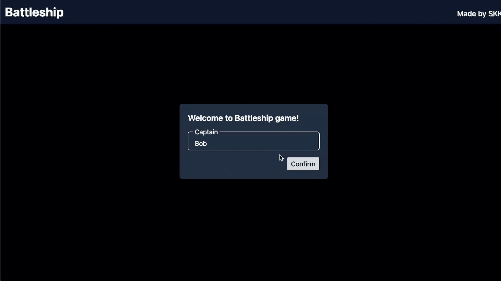

# Battleship

An interactive web-based version of a classic [Battleship](https://en.wikipedia.org/wiki/Battleship_(game)) game. Strategically command your fleet against a computer opponent, attempting to sink all enemy ships before your own are destroyed.

## Features
- Play against a computer
- Turn-based gameplay
- Visual indicators for hits, misses, and sunk ships
- Option to restart the game after each match

## What I learned
- Applying test-driven development with Jest
- How to organize file structure effectively
- Managing state across different game phrases

## Tech Stack
- JavaScript 
- HTML, CSS
- Tailwind
- Webpack
- Jest

## Acknowledgment
[The Odin Project](https://www.theodinproject.com/lessons/node-path-javascript-battleship)
